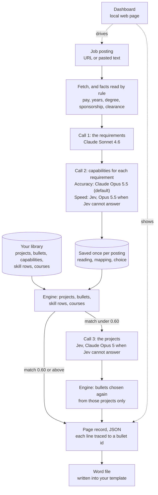
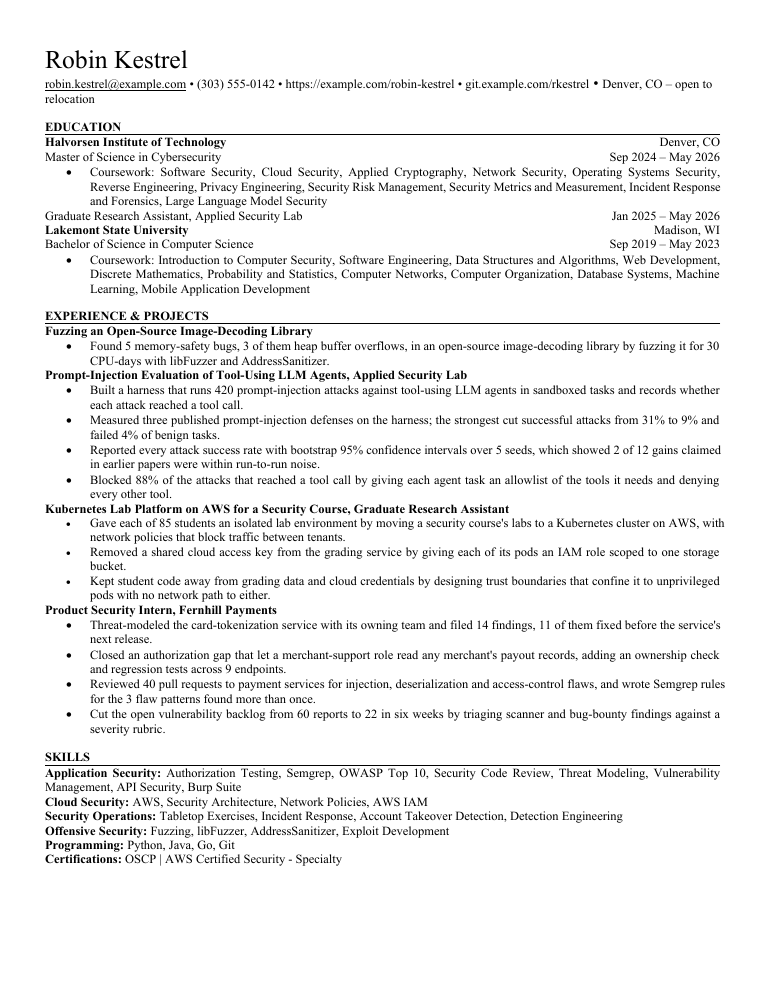

# Kingsman

Kingsman builds a one-page resume for a job posting by choosing among resume bullets the candidate has already written.

## What it does

You write a *library* once, as TOML files: your projects, and under each project its *bullets* (one true sentence
each, able to stand on the page alone); the *capabilities* each bullet demonstrates, chosen from a fixed list such as
"threat modelling" or "exploit development"; skill rows; and your degrees with their courses. Given a job posting,
Kingsman reads what the posting asks for, chooses the projects, the bullets under each, five skill rows and the
courses, and writes the page into a Word template.

Design constraints:

- **Every line on the page is text the candidate wrote.** Bullets, project titles, skill rows and courses are placed
  word for word from the library, around the template's fixed header and headings. No code path writes, rewords or
  shortens a sentence.
- **Language models only read.** They read the posting's requirements, map each requirement onto the capability list,
  and, where the engine's own page is weak, judge which projects are most relevant to the role. Nothing a model writes
  is printed on the page.
- **The page is reproducible and each line traces to its source.** Every model answer is saved once per posting, and
  the page is chosen by deterministic code from those saved answers. The page record lists each chosen bullet by its
  library id, each requirement's credit with the bullets that earn it, and every move the selector made with the
  score after it; each saved answer records the model that wrote it. The same inputs give the same page and a
  byte-identical Word file.

## How a posting becomes a page

Terms used below:

- **Call 1, call 2, call 3**: the three model calls. Call 1 lists the posting's requirements. Call 2 names, for each
  requirement, the capabilities it asks for. Call 3 names the projects that make the strongest case for the role.
- **Jev**: TypeSafe's hosted classifier. It answers structured questions with probabilities and writes no text. With
  a TypeSafe key it answers call 3, and call 2 when you choose Speed; Claude Opus answers in its place when it cannot.
- **Accuracy and Speed**: who answers call 2. Accuracy, the default, is Claude Opus 5.5. Speed is Jev, faster and
  less accurate (section "Measured numbers").
- **The engine**: the deterministic code that chooses the page. It calls no model.
- **Match**: the share of the posting's requirement weight the page meets, where a required item weighs 3 and a
  preferred one 1. *The engine's match* is the match of the page the engine builds from the whole library.
- **Hybrid mode**: the engine builds its page; where the engine's match is under 0.60, call 3 names the projects and
  the engine chooses the bullets again from those projects only. It is the dashboard's default and `--hybrid` on the
  command line.



1. The posting is fetched (Greenhouse, Lever and Ashby through their public APIs, Amazon and Workday through their
   JSON endpoints, any other page as text) or pasted. Salary, years asked, degree, sponsorship, clearance, work mode
   and level are read by rule, with no model.
2. Call 1 lists the requirements: for each, required or preferred, a short label, the words that would show it is
   met, and the posting line it came from.
3. Call 2 gives each requirement its capabilities (usually one; up to three alternatives, any one of which meets it;
   none for a bare condition) and its *conditions*: the languages, tools, platforms, degrees or certifications it
   names as needed.
4. The engine credits a requirement when a chosen bullet demonstrates one of its capabilities, and half when a bullet
   shows another capability in the same domain. It climbs a score in four passes (add, swap, fill, prune) within the
   page's 28 project lines and six project slots.
5. In hybrid mode, where the engine's match is under 0.60, call 3's projects become the only pool, and the same
   selector chooses the bullets from them under the same rules.
6. The page is written into the Word template. The writer refuses any output that differs from the template outside
   its marked slots.

The whole mechanism, with every weight and its default: [docs/MECHANISM.md](docs/MECHANISM.md).

## Sample output

The repository ships a fictional candidate's library and eight fictional postings
([examples/README.md](examples/README.md)), with the model answers saved once for each posting, and every page and
Word file built from them in [examples/output/](examples/output). As an example, the page for posting X1,
Application Security Engineer at the fictional Quillmere Health, as `page` prints it:

```text
================================================================================================
POSTING: Application Security Engineer
================================================================================================
18 requirements (14 required), 29 keywords
mode capabilities, reach 0.98, unmet word demand 12%
demand:
    sec.appsec             0.67  #############################
    sec.offensive          0.23  ##########
    sw.practice            0.08  ###
    sec.risk               0.03  #

12 bullets in 4 projects, 28/28 project lines
  coverage 0.88   emphasis 0.67   standing 0.54   incoherence 0.19   cost 0.06   depth 0.69   score 1.196

  Fuzzing an Open-Source Image-Decoding Library
      Found 5 memory-safety bugs, 3 of them heap buffer overflows, in an open-source image-decoding library by fuzzing it for 30 CPU-days with libFuzzer and AddressSanitizer.

  Prompt-Injection Evaluation of Tool-Using LLM Agents, Applied Security Lab
      Built a harness that runs 420 prompt-injection attacks against tool-using LLM agents in sandboxed tasks and records whether each attack reached a tool call.
      Measured three published prompt-injection defenses on the harness; the strongest cut successful attacks from 31% to 9% and failed 4% of benign tasks.
      Reported every attack success rate with bootstrap 95% confidence intervals over 5 seeds, which showed 2 of 12 gains claimed in earlier papers were within run-to-run noise.
      Blocked 88% of the attacks that reached a tool call by giving each agent task an allowlist of the tools it needs and denying every other tool.

  Kubernetes Lab Platform on AWS for a Security Course, Graduate Research Assistant
      Gave each of 85 students an isolated lab environment by moving a security course's labs to a Kubernetes cluster on AWS, with network policies that block traffic between tenants.
      Removed a shared cloud access key from the grading service by giving each of its pods an IAM role scoped to one storage bucket.
      Kept student code away from grading data and cloud credentials by designing trust boundaries that confine it to unprivileged pods with no network path to either.

  Product Security Intern, Fernhill Payments
      Threat-modeled the card-tokenization service with its owning team and filed 14 findings, 11 of them fixed before the service's next release.
      Closed an authorization gap that let a merchant-support role read any merchant's payout records, adding an ownership check and regression tests across 9 endpoints.
      Reviewed 40 pull requests to payment services for injection, deserialization and access-control flaws, and wrote Semgrep rules for the 3 flaw patterns found more than once.
      Cut the open vulnerability backlog from 60 reports to 22 in six weeks by triaging scanner and bug-bounty findings against a severity rubric.

  required, not fully met: API security testing, static analysis and dependency scanning, secure coding libraries
```

The same page in the Word template, rendered to one page by LibreOffice
([examples/output/paste-89f5dd84.docx](examples/output/paste-89f5dd84.docx)):



Its record, [examples/output/paste-89f5dd84.json](examples/output/paste-89f5dd84.json), holds what the section "How
to audit a page" below walks through. All eight postings:

| | posting | engine's match | projects on the page | chosen by |
|---|---|---|---|---|
| X1 | Application Security Engineer | 0.88 | G2, G1, G6, I1 | the engine |
| X2 | Offensive Security Engineer | 0.82 | G2, G1, G4, I1, U1 | the engine |
| X3 | AI Security Evaluation Engineer | 0.89 | G2, G1, I1, G3 | the engine |
| X4 | Detection and Response Engineer | 0.71 | G2, G1, G4, I2 | the engine |
| X5 | Cloud Security Engineer | 0.71 | G1, G6, G4, I1 | the engine |
| X6 | Software Engineer, Backend | 0.77 | G2, G1, G6, U3 | the engine |
| X7 | Data Analyst, Supply Chain | 0.72 | G2, G1, I1, O1 | the engine |
| X8 | Senior Accountant, the non-technical control | 0.28 | G2, G1, I1, I2 | call 3's projects |

X8 was written to be refused and was not: call 2 mapped its accounting requirements onto the capability "financial
and audit controls", and a runbook bullet showing another capability in that domain earns half credit on each,
which put the library's reach at 0.28, over the 0.25 refusal floor. Its match is low, so hybrid mode builds it from
call 3's projects. The pages' dates are 2026-09-29; a project's standing falls with
age, so a later run can differ slightly.

To see these postings in the dashboard with no sign-in and no model call, run the development server (quick start,
step 1). It serves the same page as the real dashboard, with every model answer stood in by a fixed one.

## Quick start

### What you need

- Python 3.11 or later. The whole suite has passed on Python 3.13 on Windows 11 and Python 3.12 on Ubuntu (under
  WSL); macOS has not been run.
- To read a new posting: Claude Code, signed in with a Claude account. Building pages from saved answers needs no
  sign-in and no network.
- Optional: a TypeSafe key for Jev.

### Install

From the repository root:

```sh
python3 -m venv .venv                 # Windows: py -m venv .venv
source .venv/bin/activate             # Windows PowerShell: .venv\Scripts\Activate.ps1   cmd: .venv\Scripts\activate.bat
pip install -e ".[dashboard]"         # ".[read]" for the command line alone; ".[dev]" to run the tests
```

In PowerShell, if running `Activate.ps1` is refused, allow it for the session first:
`Set-ExecutionPolicy -Scope Process RemoteSigned`. The tests need `.[dev]`: with `.[dashboard]` the lint and type
tests are skipped.

Install in editable mode (`-e`). The package looks for `library/`, `data/`, `local/` and `benchmark/` two folders
above its own package folder (`src/tailor_engine/`), which is the repository root only for an editable install. For
any other install, set `TAILOR_ROOT` to the repository root. The distribution is named `kingsman`; it installs three
Python packages, `tailor_engine` (the engine and its command line), `tailor_dashboard` (the local dashboard) and
`tailor_bench` (the measurement tools).

Versions run: claude-agent-sdk 0.2.159, fastapi 0.141.1, uvicorn 0.53.0 and 0.54.0, httpx 0.28.1, lxml 6.1.3,
keyring 25.7.0; for the tests, ruff 0.16.8 and mypy 2.3.1, which `.[dev]` pins.

On Windows, set `PYTHONUTF8=1` when you redirect a command's output to a file: characters outside the console's code
page can otherwise stop the command.

### Step 1: the dashboard on the example data, no sign-in

```sh
python tools/dev_server.py            # then open http://127.0.0.1:8771/
```

It serves the dashboard on a copy of `examples/data/` in `local/dev-data/`, with every model call, Jev request and
judge answer replaced by a fixed stand-in after a short wait. It needs no sign-in, key or network, and reads no key.
Two postings (X5 and X6) are held back as unread, so Read shows the steps of a reading; a pasted posting fails its
stand-in call 1 on purpose. Ctrl+C stops it.

### Step 2: a page and a Word file from the saved answers, no model call

The example library is the default library until you create `library/`. Point the data folder at the example data:

```sh
export TAILOR_DATA=examples/data      # PowerShell: $env:TAILOR_DATA = "examples/data"   cmd: set TAILOR_DATA=examples/data
python -m tailor_engine page paste-89f5dd84 --hybrid --output local/x1.json
python -m tailor_engine word local/x1.json --output local/x1.docx
```

`page` builds the page from the saved answers and prints it; `word` writes it into
`examples/library/resume-template.docx`. Both run offline.

### Step 3: read a posting with the models

Reading a posting makes the model calls, so it needs the Claude Code sign-in (below) and a privacy guard word (below):

```sh
python -m tailor_engine guard         # once: asks for one word that must never be sent, without echo
python -m tailor_engine read "https://job-boards.greenhouse.io/<company>/jobs/<id>" --hybrid
python -m tailor_engine page <posting id> --hybrid
python -m tailor_dashboard            # the dashboard, http://127.0.0.1:8770/
```

With `TAILOR_DATA` unset, postings and their saved answers go to `data/`. To try the dashboard on the example
postings with their real saved answers, copy the data first, so the tracker and pages it writes stay out of
`examples/`:

```sh
cp -r examples/data local/examples-data   # PowerShell: Copy-Item -Recurse examples/data local/examples-data
TAILOR_DATA=local/examples-data python -m tailor_dashboard
# PowerShell: $env:TAILOR_DATA = "local/examples-data"; python -m tailor_dashboard
```

`read` makes only the calls whose answers are not saved yet, and prints `model calls: none, already read` when there
are none to make. To start your own library, copy `examples/library/` to `library/` and follow
[ONBOARDING.md](ONBOARDING.md); from then on `library/` is the default.

### Sign in to Claude Code

Calls 1, 2 and 3 on Claude, and the judges, run through the Claude Code command line that the Claude Agent SDK
installs with `.[read]`. Install Claude Code, run `claude` once and sign in. That the SDK's copy of the command line
uses the same stored sign-in is inferred; it has been run on one machine only.

Models are asked for by full name: `claude-sonnet-4-6` for call 1, `claude-opus-5-5` for call 2 on Accuracy (and
wherever Jev cannot answer call 2) and for both judges, `claude-opus-5` for call 3 when Jev cannot answer. Which
Claude plans include them has not been checked.

There is no API-key path: an `ANTHROPIC_API_KEY` found in the environment is passed to the command line as empty, so
a stray key never changes how calls are billed.

On security content, Claude Opus 5.5's safety classifier can stop an answer; the command line then asks Claude Opus
4.8, which answers. This was measured on the judges, and on call 3 while it asked Opus 5.5; call 3 now asks Claude
Opus 5, which did not fall back on 31 postings, and call 2 was answered by Opus 5.5 itself, the example postings
included. For calls 1, 2 and 3 the saved record keeps the model asked for, the model that answered and the reason, and
`read` prints a line of the form `call 2 was answered by <model> in place of <model asked for>: <reason>` to standard
error. The answer is used as normal.

### The TypeSafe key (optional)

```sh
python -m keyring set typesafe jev     # asks for the key without echo
```

The key is kept in the operating system's credential store (Windows Credential Manager, macOS Keychain, or a Secret
Service on Linux). Kingsman reads it when it makes a Jev request, puts it only in that request's header, and never
logs or saves it.

Without a key, or on a machine with no credential store (common on headless Linux and WSL), every Jev request fails
before anything is sent: Claude Opus 5 answers call 3, and Claude Opus 5.5 answers call 2 on Speed. Accuracy never
asks Jev. Each saved answer records the fallback and its reason, and `read` prints it. To leave Jev out entirely, set
`TAILOR_CLASSIFIER=opus` or pass `--classifier opus` to `read`. Before storing a key, read TypeSafe's own terms on
who can open an account and how long requests are kept; what Kingsman sends there is listed under Privacy below.

### The privacy guard

Calls 2 and 3 and the judges send text to a model provider, and each passes a guard first. The guard refuses text
containing any email address, "noreply" or "github.com/", or any word whose SHA-256 fingerprint is listed in
`local/identity-fingerprints.txt`. **Without that file, or with no fingerprint in it, calls 2 and 3 and the judges
are refused**, with this message:

```text
<repository>/local/identity-fingerprints.txt is missing; nothing is sent to a model without it. Add a word that must
never reach a model provider with: python -m tailor_engine guard
```

Call 1 is made before the guard is asked, so a first `read` saves the posting's reading and then stops; run `guard`,
then `read` again, which makes only the calls left.

Add the words that must never reach a provider: handles, account names, private project or client code names. The
guard compares whole words of letters and digits, ignoring case. The fingerprints are unsalted, so anyone holding the
file can confirm a guessed word: keep `local/` as private as the words themselves.

## Commands

```text
python -m tailor_engine read SOURCE [--hybrid] [--refresh] [--call2 opus|jev] [--classifier jev|opus]
                                    [--title T --company C]
    SOURCE is a posting URL, a posting .json, or a pasted posting as a text file (then --title and --company name
    it). Saves the posting, prints its facts, and makes calls 1 and 2 where their answers are not saved.
    --hybrid also makes call 3 when the engine's match is under 0.60. --refresh makes the calls again.
    --call2 names who answers call 2: opus (Accuracy) or jev (Speed); default TAILOR_CALL2, else opus.
    --classifier names who answers call 3 (default TAILOR_CLASSIFIER, else jev); opus also answers call 2.
python -m tailor_engine page POSTING [--hybrid] [--projects N] [--output FILE]
    POSTING is a posting id in the data folder or a posting .json. Builds the page from the saved answers with no
    model call, prints it, and writes the record to <data>/pages/cli/<id>.json or FILE. --hybrid uses call 3's saved
    projects where the engine's match is under 0.60. --projects sets the most projects (default 6).
python -m tailor_engine word PAGE --output FILE.docx [--overwrite]
    Writes a page record into <library>/resume-template.docx.
python -m tailor_engine guard
    Adds one word's fingerprint to local/identity-fingerprints.txt.

python -m tailor_dashboard [--port 8770]
    The dashboard at http://127.0.0.1:8770/, answering only on this machine. Its "How pages are built" menu sets
    Hybrid or Legacy (the engine's projects on every page) and Matching: Accuracy or Speed.

python -m tailor_bench read [--choices] [--classifier jev|opus]
    Makes calls 1 and 2 for every benchmark posting whose answers are missing or stale, three at a time; --choices
    also makes call 3 for every benchmark posting whose saved choice is missing or stale.
python -m tailor_bench benchmark [--hybrid] [--weights NAME=VALUE ...] [--label NAME]
    Agreement between the engine's pages and your labelled pages, by band, from saved answers, with no model call.
    A run with --weights needs --label. Writes <benchmark>/runs/benchmark-<label>.json.
python -m tailor_bench run URL --label NAME [--data FOLDER] [--no-judge] [--classifier jev|opus]
    One posting from its URL to a judged hybrid page, every step timed, into <benchmark>/runs/NAME/. The posting and
    its saved answers go to <benchmark>/runs/NAME/data/, or FOLDER, never to the data folder.
python -m tailor_bench judge LABEL [--data FOLDER]
    Judges the page saved in <benchmark>/runs/LABEL/page.json; the posting is looked up in FOLDER/postings/ (default
    <benchmark>/runs/LABEL/data/postings/).

python -m unittest discover -s tests
    The tests. None reaches a model, TypeSafe or the credential store, and none leaves this machine.
python tools/dev_server.py [--fresh] [--copy NAME] [--port 8771]
    The dashboard on a copy of the example data in local/NAME/ (default local/dev-data/), with every model call,
    Jev request and judge answer replaced by a stand-in. Needs no sign-in, key or network. --fresh makes the copy again.
bash tools/check.sh baseline
bash tools/check.sh [full]
    The output check for a change meant to leave behaviour alone (ONBOARDING.md, section 15): the baseline before
    the change, the check after it. On Windows run it from Git Bash with PYTHON=.venv/Scripts/python.exe; the bash
    that PowerShell finds is WSL's, which cannot see the virtual environment.
```

| variable | default | what it sets |
|---|---|---|
| `TAILOR_ROOT` | the repository root | where `library/`, `data/`, `local/` and `benchmark/` are found |
| `TAILOR_LIBRARY` | `<root>/library` once it exists, else `<root>/examples/library` | the library folder, the Word template included |
| `TAILOR_DATA` | `<root>/data` | saved postings, readings (call 1), mappings (call 2), choices (call 3) and pages |
| `TAILOR_BENCHMARK` | `<root>/benchmark` | the benchmark the `tailor_bench` tools read; `examples/benchmark` is an illustrative one |
| `TAILOR_CALL2` | `opus` | who answers call 2: `opus` (Accuracy) or `jev` (Speed, Opus when Jev cannot answer) |
| `TAILOR_CLASSIFIER` | `jev` | who answers call 3: `jev` (Opus when Jev cannot answer) or `opus`, which also answers call 2 |

## Measured numbers

In short (every figure, how it was measured and its limits: [docs/MEASUREMENTS.md](docs/MEASUREMENTS.md)):

- **Time.** Call 1 takes a median of 10.1 s a posting; call 2 on Accuracy 8 to 10 s alone (about 17 s for five
  postings sharing one call), on Speed about 1.5 s; call 3 on Jev about 0.5 s. A page is rebuilt from saved answers,
  with no model call, in about 1 s.
- **Cost.** Claude calls count against the signed-in Claude plan. Jev costs about $0.005 a posting for call 2 on
  Speed and $0.0002 for call 3.
- **Quality.** Measured on the developer's own library and a private benchmark of real postings, so not reproducible
  from this repository: blind labels sided with Opus over Jev on call 2 (152 to 50 where they differed), which is why
  Accuracy is the default; pages built from call 3's projects were preferred where the engine's match is under 0.60.
  One library, one field; no recruiter labelled a page.

## Privacy

What leaves the machine, and to whom:

| step | sent to | what is sent |
|---|---|---|
| fetching | the job board's public API, or the posting's own web page | a request for the posting's URL |
| call 1 | Anthropic, through Claude Code | the posting's first 14,000 characters, as numbered lines |
| call 2 | Anthropic on Accuracy; TypeSafe on Speed, Anthropic when Jev cannot answer | the role title; each requirement's label, words and required flag; every capability name in `capabilities.toml` with its domain, and on Speed each capability's description from `capability-descriptions.toml`. Nothing from your projects |
| call 3 | TypeSafe; Anthropic when Jev cannot answer | the posting's title and first 7,000 characters; for each project with a usable bullet, its id, title, one-line summary, status line and end date. No bullet text |
| judges (optional) | Anthropic | the role title and company; the posting's first 9,000 characters; each degree's award, institution and dates; every project with a written bullet, held projects and fragile bullets included, with its title, status line, end date, up to three notes and every bullet; the page; in the dashboard, each requirement's credit on the page |

- In the dashboard's hybrid mode, with Jev answering call 3, call 3 is made for every posting read, beside call 1,
  whether or not the page ends up using it. Opus's call 3 is made only for a page whose match is under 0.60.
- The judges leave out notes marked `private` and notes that mention publishing, repositories, commits, handles or
  identity (the full list is in [docs/LIBRARY.md](docs/LIBRARY.md)). A held project and a fragile bullet are kept off
  every page, and are still sent to the judges.
- The guard reads the whole of call 2's request, the project list before call 3, and the library text and page before
  each judge call. Call 1 sends only the posting and is not checked.
- The package's own network requests are the fetches and the Jev requests. Model calls run the Claude Code command
  line as a separate program; its own network traffic is outside this package.
- The fetcher refuses LinkedIn URLs, whose terms forbid automated access (paste those postings), and any request,
  redirects included, to a host that resolves to a private or local address.
- The dashboard binds to 127.0.0.1, answers only requests whose Host header names this machine, and accepts a
  request that changes anything only with its own `X-Tailor` header, which another website's page cannot send
  without the server's permission.
- Kept on this machine: postings, saved answers and pages in `data/`; the fingerprints in `local/`; the Jev key in the
  operating system's credential store, which Kingsman reads and never writes. `library/`, `data/`, `local/` and
  `benchmark/` are left out of version control.

## Limitations

- Tuned and measured on one library. The capability vocabulary was drafted around security and AI roles, and the
  weights were fitted on that library's benchmark. The example control posting shows one effect: accounting
  requirements land on the vocabulary's one audit capability, in the security risk and compliance domain, where
  half credit through a neighbouring capability keeps the posting over the refusal floor.
- One page layout: a three-line header, two degrees with one fixed line under the first, five chosen skill rows and a
  fixed certifications line, and up to six projects in 28 lines. The Word template is pinned by its SHA-256 (the
  example template's in `src/tailor_engine/rendering/word.py`, or your own in `library/resume-template.sha256`) and
  by the paragraph ids of its 13 slots, constants in the same file; saving the template in Word changes its hash,
  and another layout needs code changes.
- Reading a posting needs a Claude Code sign-in.
- The library is written by hand.
- Each page rests on one saved answer per call. Two readings of one posting by call 1 differ on about 8% of
  requirements; call 2 on Opus gave the same capability on 0.93 of requirements from one run to the next; two runs of
  call 3 on Opus over 31 postings chose the same set of projects on 16, with a mean overlap of 0.859.
- Call 1 reads a posting's first 14,000 characters, call 3 its first 7,000 and the judges its first 9,000.
- Conditions are matched as literal words: "LLMs" does not match "language-model".
- Skills printed on a page are not checked against the chosen bullets.
- A posting is refused when the whole library could meet under 25% of its requirement weight. That threshold was
  chosen with an earlier matching method; on the private benchmark it now refuses one of the four non-engineering
  postings it was chosen to refuse, and it does not refuse the example control posting.
- A host that changes its DNS answer between the fetcher's address check and the connection is not caught.
- The dashboard's list of requirements that screen candidates out (U.S. citizenship, a security clearance, no visa
  sponsorship, three or more years asked) is fixed in code.

Kingsman does not write or reword text, write cover letters, apply to jobs, read your existing resumes or
repositories, call the models with an API key, or use a page layout other than the one it pins.

## How to audit a page

The records in [examples/output/](examples/output) can be checked this way against
[examples/library/projects.toml](examples/library/projects.toml).

1. **The page record**: `<data>/pages/cli/<id>.json` from `page`, or the file `--output` names; the dashboard keeps its
   own in `<data>/pages/<id>.json`. `selected` lists the chosen bullet ids. Each is a `[[project.bullet]]` in
   `projects.toml` whose `text` is printed unchanged; `page` holds the projects in printed order with their bullet
   text.
2. **Why each requirement is met.** `requirement_credit` gives each requirement its credit (1 met; 0.5 met through
   another capability in the same domain, or met without showing a condition it names; 0.25 both; 0 missing) and the
   bullets that earn it. `requirements` gives each requirement's capabilities and conditions; compare them with the
   earning bullets' `capabilities` in `projects.toml`, each with its `why`. `missing_required` lists the required
   items not fully met, and `unmapped` the requirements call 2 gave no capability.
3. **What the models said.** The reading, `<data>/readings/<id>-<key>.json`, holds each requirement with the posting
   line it came from (`source`). The mapping, `<data>/mappings/<key>.json`, holds call 2's answer with `model`,
   `answered_by` and any `fallback`. `<key>` is the first 16 hexadecimal characters of the SHA-256 of the posting's
   text.
4. **How the page was chosen.** `trace` lists every accepted move as `[pass, ids, score after]`: the pass is `add`,
   `swap`, `fill`, `prune` or `refill`, and the ids are the bullet taken (for a swap, the bullet out and the bullet
   in; for a prune, the project dropped). `coverage`, `emphasis`, `standing`, `incoherence`, `cost` and `depth` are
   the score's terms, and `score` is their weighted sum with the weights in `src/tailor_engine/selection/weights.py`.
5. **Hybrid pages.** `projects_by` is `engine` or `model`. When it is `model`, `engine_match` is the engine's own
   match, `choice.projects` the projects call 3 named and `choice.placed` those that reached the page. Call 3's answer
   is in `<data>/choices/<key>.json`.
6. **Reproduce it.** Run `page` again: with the same saved answers, library and date, the record is the same. Run
   `word` twice on one record: the files are byte-identical. A project's age is counted in days, so a page can change
   as dates pass.

## Documents

- [ONBOARDING.md](ONBOARDING.md): from nothing to your own pages, then calibrating and benchmarking.
- [docs/MECHANISM.md](docs/MECHANISM.md): how the engine chooses, with every weight.
- [docs/LIBRARY.md](docs/LIBRARY.md): the library files, field by field.
- [examples/README.md](examples/README.md): the example candidate, postings, saved answers, pages and benchmark.
- [docs/MEASUREMENTS.md](docs/MEASUREMENTS.md): every measured figure, with how it was measured and its limits.

## Licence and author

Copyright (c) 2026 Srivatsan Samraj, built with Claude (Anthropic). All rights reserved: see [LICENSE](LICENSE).
